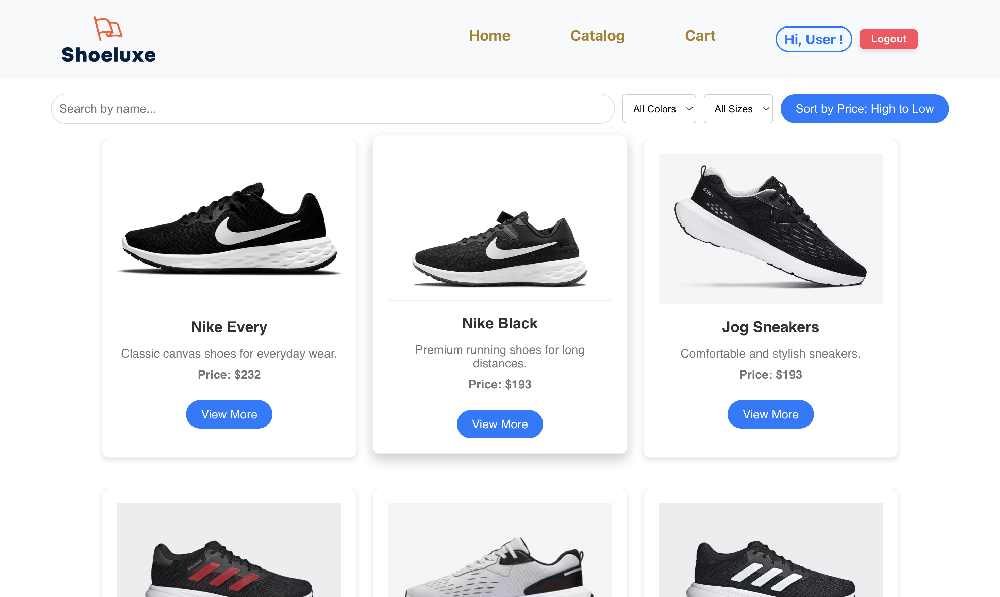
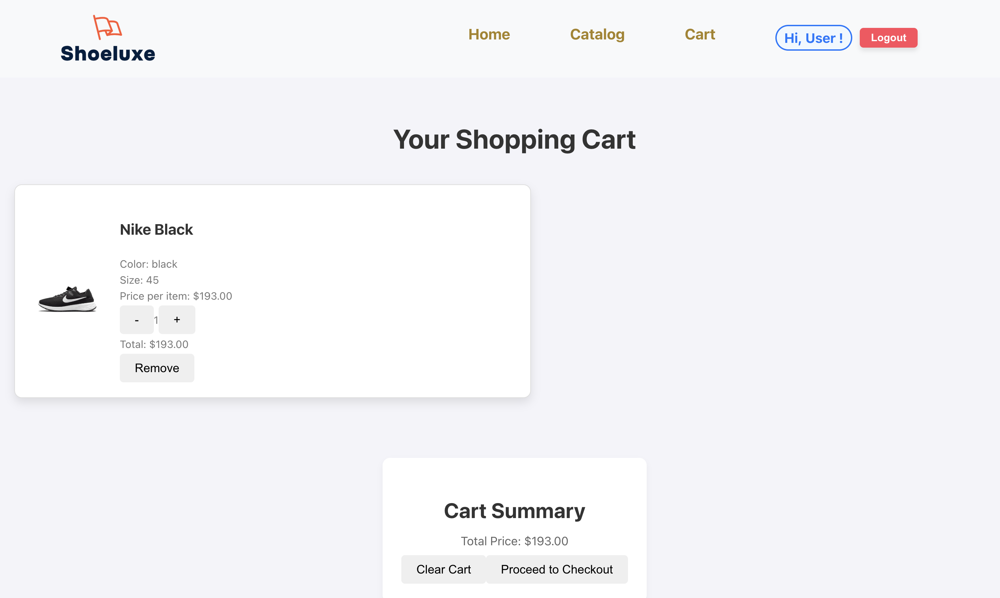
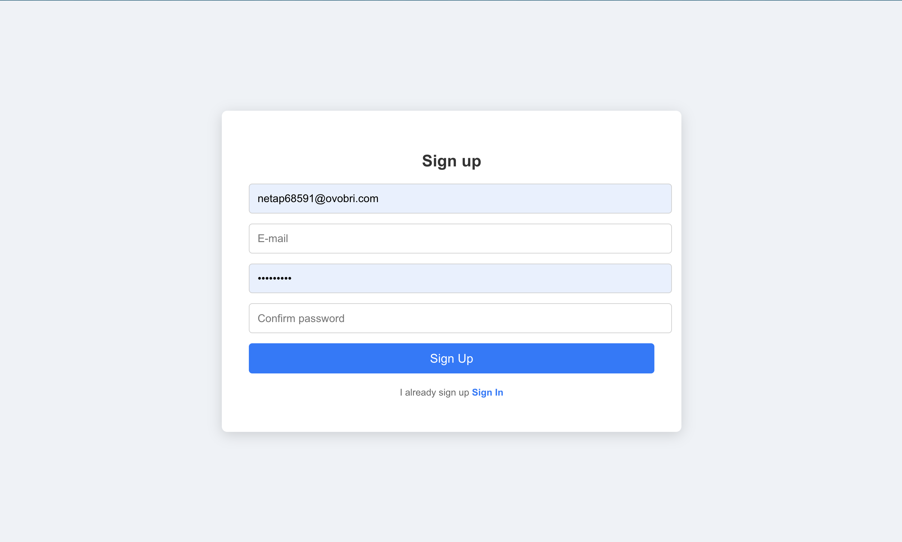
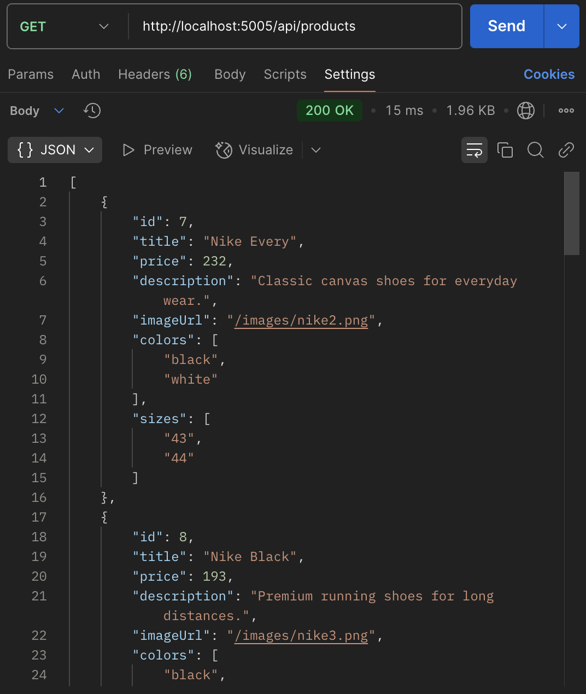
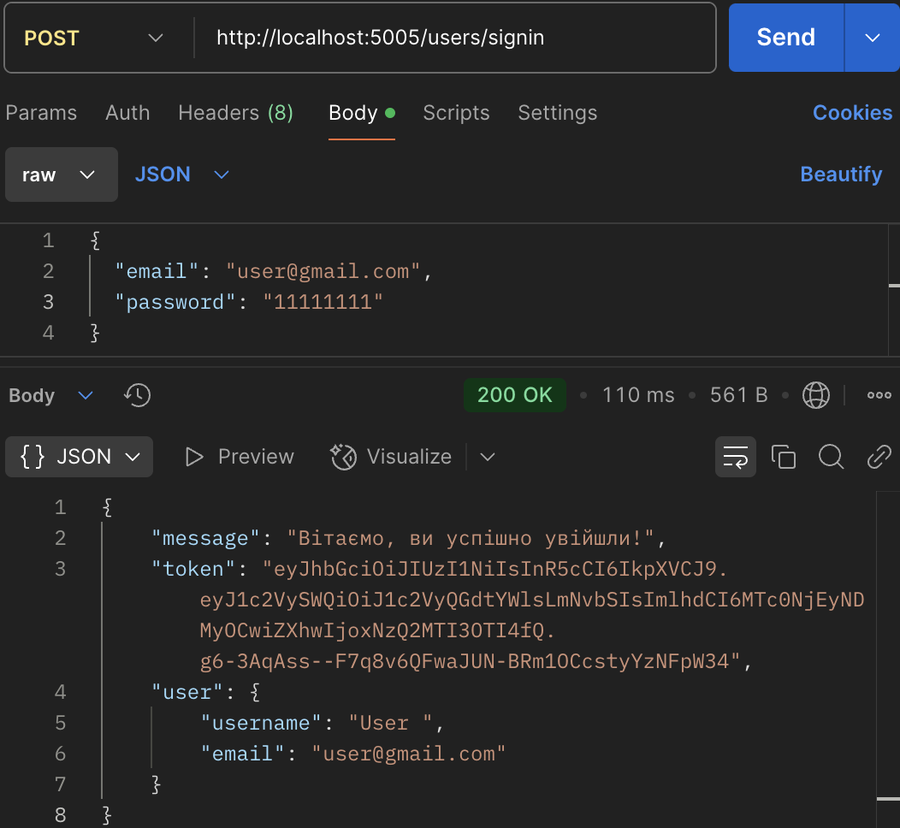

# 🛒 ShoeShop

This is a full-stack CRUD-based e-commerce application built with **JavaScript**, **Node.js**, and **React.js**. It features full functionality for managing products, including sorting, searching, filtering, and a shopping cart system integrated with **Redux**.

---

## ✨ Features

### Frontend (React.js)

- **Home Page**: Structured layout with header, navigation, catalog preview, and footer.
- **Catalog Page**:
  - Product list rendering via `map()`
  - Real-time **filtering** and **searching** by product properties (size, color, type, etc.)
  - "View more" feature to reveal additional details
- **Item Page**:
  - Detailed view of a selected item
  - "Add to Cart" functionality
- **Cart Page**:
  - Uses **Redux** for state management
  - Ability to **add/remove items**
  - Display of total count and summary
- **Routing**: Navigation handled using `react-router-dom`
- **Spinner/Loader**: Shown while data is loading from the backend
- **Reusable Components**: Like `<PrimaryButton />`, `<Select />`, etc.

## Backend (Node.js with Express)

## 🔒 User Authentication

- **POST /users/signin** — user login (retrieving token)
- **POST /users/signup** — user registration
- **POST /users/logout** — user logout (invalidates token)
- **GET /users/me** — get information about the logged-in user (requires token)

## 🛒 Products

- **GET /api/products** — retrieve all products with filtering options (by title, color, size) and sorting (by price)
- **GET /api/products/:id** — get product details by ID

## ⚙️ Middleware & Features

- **Authorization Middleware**:
  - Protects routes that require a JWT token to access user-specific data or perform actions.
  - Verifies the token provided in the `Authorization` header of the request.
- **Filter support** via query parameters (e.g., `GET /api/products?color=red&size=L`)
- **CORS** and **JSON middleware**
- Mock data is stored in a JSON format

---

## 🛠️ Tech Stack

| Frontend     | Backend    | State Mgmt | Styling |
| ------------ | ---------- | ---------- | ------- |
| React.js     | Node.js    | Redux      | CSS     |
| react-router | Express.js |            |         |
| Axios        | REST API   |            |         |

---

## 🚀 How to Run

> 💡 Make sure you're in the correct directory before running the commands below.

### 1. Clone the Repository

```
git clone https://github.com/your-username/ecommerce-crud-app.git
cd ecommerce-crud-app
```

### 2. Install Dependencies

#### Backend (`shoe_shop/src/server`)

```
# Navigate to the server directory first
node server.js
```

#### Frontend

```
npm install
```

### 3. Run the App

#### Start backend

```
node index.js
```

### Start frontend

```
npm start
```

## 📸 Demo Preview

### 🏠 Home Page


### 🛍️ Catalog Page



### 🛒 Cart Page



### 📝 Signup Page



### 📡 Backend: GET Request



### 🔐 Backend: Sign In Request


